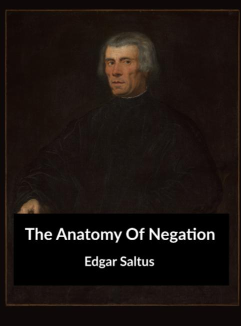

--- 
title: "The Anatomy Of Negation"
author: "Edgar Saltus"
site: bookdown::bookdown_site
output: bookdown::gitbook
documentclass: book
bibliography: [book.bib, packages.bib]
biblio-style: apalike
link-citations: yes
---

# The Anatomy Of Negation {-}

> Quoy qu'on nous presche, il fauldroit toujours se souvenir que c'est I'honime qui donne et l'homme qui reçoit.

- Montaigne

> II est un jour, une heure, où dans le chemin rude, 
Courbé sous le fardeau des ans multipliés, 
L'Esprit humain s'arrête, et pris de lassitude, 
Se retourne pensif vers les jours oubliés.

> La vie a fatigué son attente inféconde; 
Désabusé du Dieu qui ne doit point venir, 
II sent renaître en lui la jeunesse du monde; 
II écoute ta voix, ô sacré souvenir!
  
> Mais si rien ne répond dans l'immense étendue 
Que le stérile écho de l'éternel désir, 
Adieu, déserts, ou l'âme ouvre une aile éperdue!
Adieu, songe sublime, impossible à saisir.
  
> Et toi, divine Mort, où tout rentre et s'efface, 
Accueille tes enfants dans ton sein étoilé;
Affranchis-nous du temps, du nombre et de I'espace, 
Et rends-nous le repos que la vie a troublé.

- Leconte de Lisle

**Prefatory Note**

The accompanying pages are intended to convey a tableau of anti-theism from Kapila to Leconte de Lisle. The anti-theistic tendencies of England and America have been treated by other writers; in the present volume, therefore, that branch of the subject is not discussed. To avoid misconception, it may be added that no attempt has been made to prove anything.

- Biarritz, 15th September, 1886.

